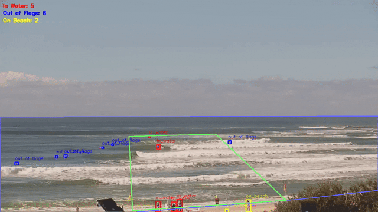

# Lifeguard Alert - Object Detection (Assessment Task 3) 
I completed this project in a small group with Jeonghyeon Kim and Jungmin Kim as our final mini project for 42028: Deep Learning and Convolutional Neural Network at the beginning of 2025.

### Demo 

    
    

Annotated Surf Camera Mooloolaba -
[Demo 1 MP4](realtime-app-test/static/assets/annotated_surfline_mooloolaba_20250525_1141.mp4?raw=1)

Annotated Surf Camera Greenmount -
[Demo 2 MP4](realtime-app-test/static/assets/annotated_surfline_greenmount_20250521_1314.mp4?raw=1)

### Dataset
The dataset was created from scratch using manually downloaded video footage from Surfline cameras positioned across 20 different beaches along Australia’s East Coast. From each 1-minute video, we extracted 12 frames - one every 5 seconds - to increase diversity as wave patterns and swimmer position changes quite frequently. All images were 1280 × 720 pixels in size. Image annotation in CVAT was a time-consuming process that took a couple of weeks to complete, as some images contained over 100 people each requiring an accurate bounding box - even distant swimmers. Even though there wasn’t much beach diversity with only 20 different beaches, it wasn’t an issue since the prototype model was only trained to detect the ‘person’ class.

Overall, we annotated a total of 1,459 images resulting in 25,801 labelled ‘person’ objects. We used only a single class ‘person’ during annotation. These were later processed into two categories (‘in-water’ or ‘on-beach’) based on whether the bounding box was inside or outside the ‘water’ polygon. We consulted with the subject coordinator, Professor Nabin, before making the dataset split as there were concerns about data leakage if images from the same camera angles were in multiple subsets. However, because the background (e.g. beach, waves, or sky) is not used as a feature in detection we were told that shuffling the dataset was acceptable. We then split the data into training (80%), validation (10%), and testing (10%) subsets which resulted in 1,167 images for training, 145 images for validation, and 147 images for testing. I haven’t included the dataset in this repository due to licensing, privacy considerations, and storage limitations. It was created and used solely for academic coursework.  

### GUI  
I’ve included a very basic Flask web app in this repository to simulate real-time detection and send SMS alerts. We used this app for debugging and testing before moving onto a Streamlit app for our final deliverable. 

### Discussion
-	Even though we collected and annotated a diverse dataset of 1,459 images, the model’s performance could have been improved with higher-quality footage and a larger dataset with upwards of 5,000 or more annotated images. But since this was a prototype, we accepted the use of pixelated Surfline videos (due to compressed livestream videos). One challenge was distinguishing swimmers from surfers - our original goal - but this proved infeasible as distant individuals often appeared as small, indistinct shapes (typically just heads above water) making it nearly impossible to tell if someone was on a board.

-	With only three weeks remaining we changed our project idea to a crowd management app for lifeguards. This meant that we needed to work fast to collect and annotate images from Surfline footage to make our dataset. Annotation took longer than expected due to the sheer amount of people to annotate and the numerous quality checks we needed to perform. With only one week left, we chose to experiment with 3 YOLOv8 models to compare which one would be best for our problem. Although we initially considered training a custom RF-DETR Transformer model time constraints and the need for real-time performance made this impractical. Coding the final YOLOv8m model took only a few days to fine-tune, and training was fairly straightforward with no real bottlenecks. 

-	The crowd management app was not our first project idea. We spent most of the semester working on a rip current detection app by collecting a range of front-on rip current videos and coding a 3D-CNN which used Optical Flow to track the movement of the water. However, after speaking to Professor Nabin we learned that the dataset was too noisy and the problem too complex - as rip current classification needs a higher drone viewpoint rather than front-on beach view to notice patterns/features.

### My Contribution
Although our original idea - a rip detection app using 5s beach videos - didn’t fully work out, I spent the beginning of the semester filming rips across Sydney, consulting with lifeguards and academics (including Professor Rob Branders), curating the dataset, and coding a very basic 3D-CNN model. When we changed to a new idea with only three weeks remaining: I collected 80 videos from Surfline for image extraction, annotated approximately 800 images in CVAT over two weeks (manually checking each one), and split the dataset into training, validation, and testing subsets. I coded both the Experiments and Final Model Training notebooks, setup the polygon functionality for detecting/counting people ‘in-water’ as well as ‘inside-the-flags’, and created a test Flask GUI (which I’ve included in this repository). Group contribution was balanced throughout the semester and we were able to work well as a team to successfully complete the project on time.

### References
Dataset References: 
All images for our dataset were manually extracted from Surfline livestream cameras (https://www.surfline.com/) across Sydney beaches.

Code References: 
Ultralytics. (n.d.). Model training with Ultralytics YOLO. Ultralytics YOLOv8 documentation. https://docs.ultralytics.com/modes/train

Yaseen, M. (2024). What is YOLOv8: An In-Depth Exploration of the Internal Features of the Next-Generation Object Detector. https://arxiv.org/html/2408.15857v1
